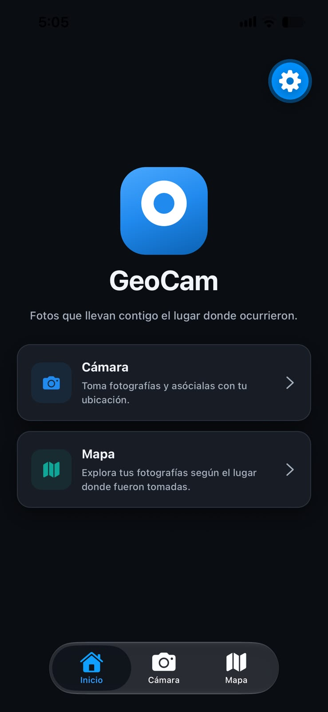
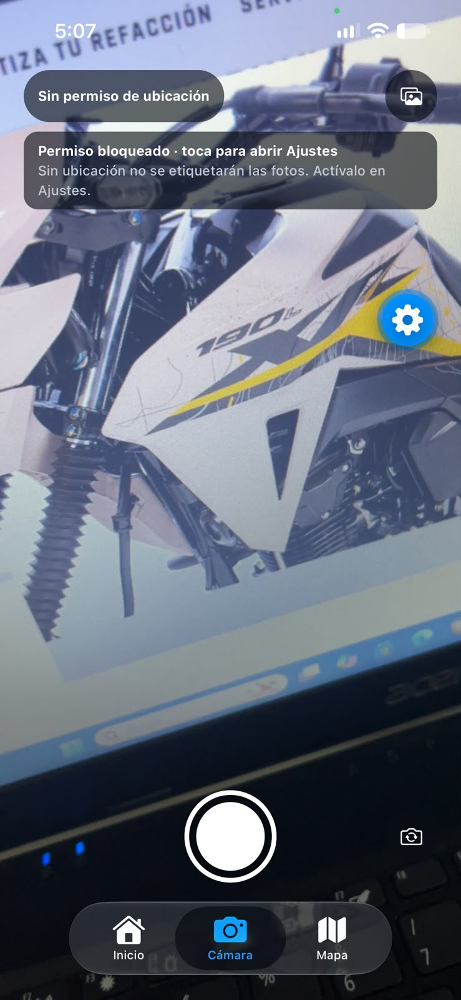
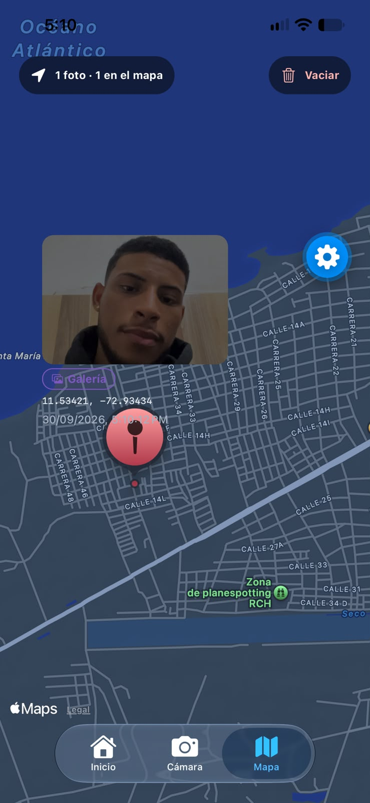
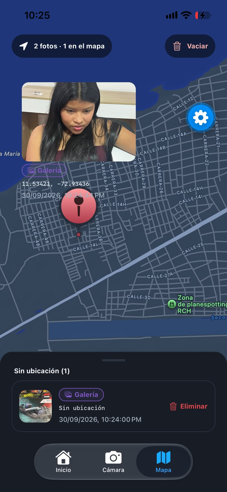
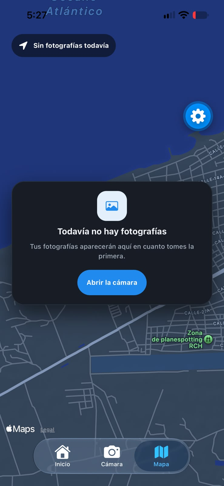
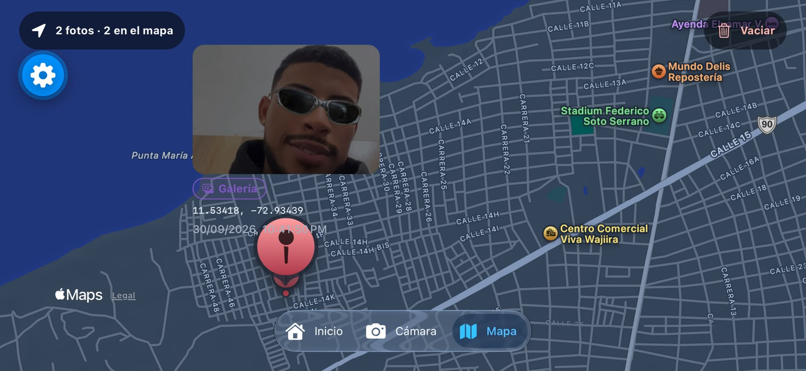
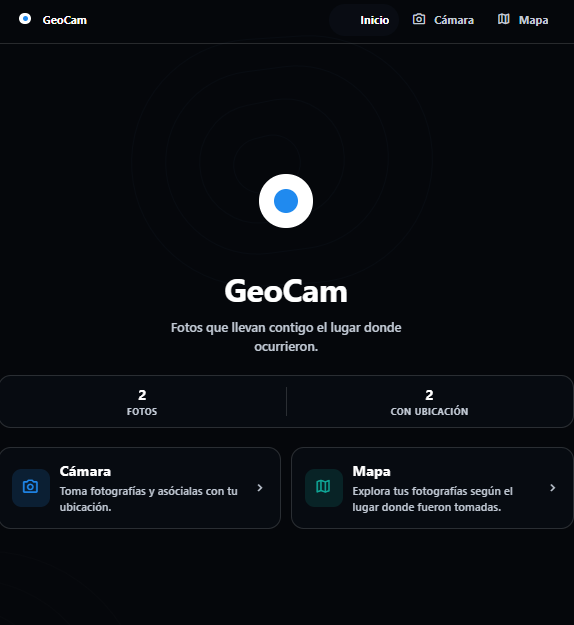
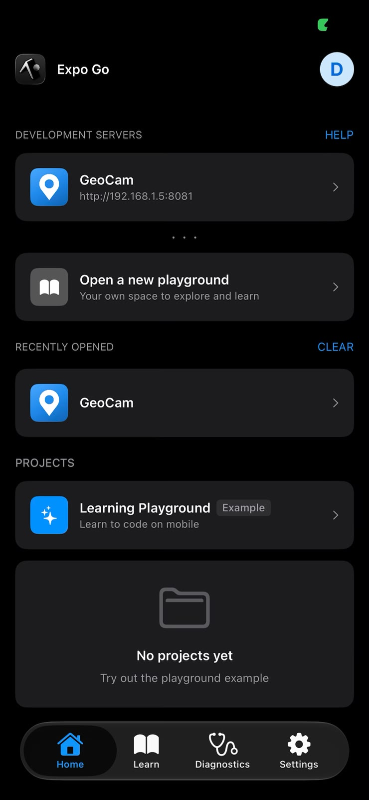
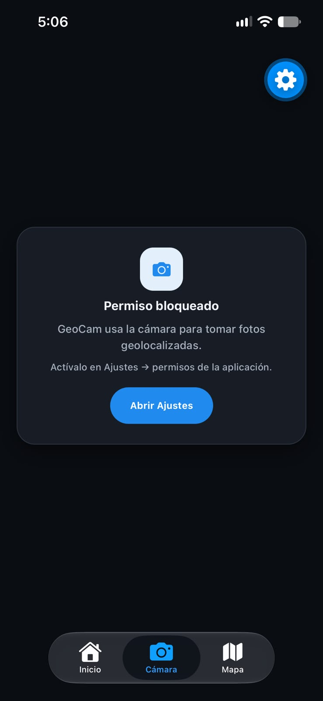

# GeoCam

App móvil (Expo SDK 57 + Expo Router + TypeScript) para **capturar fotos geolocalizadas**,
etiquetarlas con las coordenadas del dispositivo y verlas en un mapa.

---

## Semana 6 – GeoCam

### Objetivo

Construir una app de cámara que registre **dónde** se tomó cada foto, con tres estados de permiso
bien diferenciados, seguimiento de GPS en primer plano y detección de sacudidas con el
acelerómetro.

### Qué incluye

| Pantalla | Ruta | Qué hace |
| --- | --- | --- |
| Inicio | `src/app/(tabs)/index.tsx` | Presentación de la app, contador de fotos en tiempo real y dos accesos: *Abrir cámara* y *Ver mapa*. No pide ningún permiso. |
| GeoCam | `src/app/(tabs)/geocam.tsx` | Vista de cámara a pantalla completa, coordenadas en vivo, botón de galería, cambio de cámara frontal/trasera y detección de sacudidas. |
| Mapa | `src/app/(tabs)/mapa.tsx` | `MapView` con un `Marker` por foto geolocalizada y `Callout` con miniatura. Lista aparte de las fotos **sin coordenadas**. |
| Mapa (web) | `src/app/(tabs)/mapa.web.tsx` | Sustituye a `mapa.tsx` en web, donde `react-native-maps` no existe. Muestra todas las fotos en dos grupos (*En el mapa* / *Sin ubicación*) con sus coordenadas. |

Las tres pestañas viven en el grupo `(tabs)`, y el estado de las fotos se comparte con
`GeoPhotosProvider` montado en `src/app/(tabs)/_layout.tsx` (no en el layout raíz).

### Sistema de diseño

Todo el aspecto visual sale de `src/constants/theme.ts`; ninguna pantalla define colores,
espaciados ni radios sueltos.

| Bloque | Qué aporta |
| --- | --- |
| `Colors` | `text`, `background`, `backgroundElement`, `backgroundSelected` y `textSecondary`, en variante clara y oscura. |
| `Surfaces` | `border` y dos sombras (`shadow`, `shadowStrong`). `useTheme()` las fusiona con `Colors`, de modo que `theme.border` y `theme.shadow` están disponibles junto a `theme.text`. |
| `Brand` | Identidad, independiente del tema: azul `#208AEF` (`primary`, `primaryLight`, `primaryDeep`, `primarySoft`), verde azulado del mapa (`map`, `mapSoft`), `danger`, `onBrand` y los tonos para overlays oscuros. |
| `Spacing` · `Radii` · `Layout` | Escala de espaciado en múltiplos de 4, radios (`sm`…`pill`) y medidas de maquetación (`contentMaxWidth`, `gutter`, `minTouch`). |
| `Night` | Superficies de la pantalla de Inicio, que es **siempre oscura**: `backdrop`, `fill`, `fillStrong`, `border`, `contour` y `contourAccent`. No dependen del tema del sistema. |

Reglas que siguen las tres pantallas:

- **Todo control táctil es un `Pressable`** (no `TouchableOpacity`) y recibe
  `accessibilityRole="button"`, una etiqueta y una altura mínima de `Layout.minTouch` (44 pt).
- **Un solo criterio tipográfico**, `ThemedText`, con variantes `hero`, `cardTitle`, `title`,
  `subtitle`, `default`, `small`, `smallBold`, `label` y `code`. Las variantes de color son
  explícitas (`themeColor="textSecondary"`) y, sobre superficies oscuras, se usa
  `tone="onDark"` / `tone="onDarkMuted"`, que toma el color de la marca en vez del del tema.
- **Iconos con `expo-symbols`**, sin dependencias nuevas: SF Symbols en iOS y Material Symbols en
  Android y web. Los nombres válidos están centralizados en `src/constants/icons.ts`.
- **Anchos máximos** (`Layout.contentMaxWidth`) y `useWindowDimensions` para que tablet y
  escritorio no estiren la interfaz; el `padding` lateral es siempre `Layout.gutter`.
- **Safe areas** con `useSafeAreaInsets().top` / `.bottom` en lugar de constantes fijas.

### Pantalla de Inicio: fondo topográfico

El fondo de Inicio es negro con curvas de nivel y **no depende del tema del sistema**: se ve igual en
modo claro y en modo oscuro. `src/components/TopographicBackdrop.tsx` lo dibuja entero con `View`s
—cada colina es una serie de elipses concéntricas con borde de 1 px, desplazadas e inclinadas para
que el conjunto parezca un relieve y no un blanco y negro— sin imágenes, sin SVG y sin ninguna
dependencia nueva. Las medidas salen de `useWindowDimensions`, así que el mapa se adapta a tablet y
horizontal sin tocar el código.

### Rotación

`app.json` declara `"orientation": "default"`, de modo que la app **sí gira** con el dispositivo.
Todas las pantallas lo soportan: usan `useWindowDimensions` y safe areas, no medidas fijas.

### Identidad

El logotipo está construido con `View`s en `src/components/GeoCamLogo.tsx` (un pin de mapa cuya
cabeza es la lente de la cámara) y se reutiliza en Inicio, en la cabecera de web y como icono
adaptativo. Los PNG de `assets/images/` (`icon`, `favicon`, `splash-icon`,
`android-icon-*`) se generan a partir del mismo diseño.

### Hooks entregados

| Hook | Responsabilidad |
| --- | --- |
| `src/hooks/useCamera.ts` | `CameraView` + `useCameraPermissions`, referencia tipada, `isReady`, `isCapturing` (bloquea dobles capturas), `takePictureAsync`, cambio de cámara y `openSettings()`. |
| `src/hooks/useGeoLocation.ts` | Consulta el permiso sin pedirlo, `requestForegroundPermissionsAsync` bajo demanda, `getCurrentPositionAsync`, `watchPositionAsync` con cleanup, error como estado y `openSettings()`. `refresh()` **reutiliza el fix del watch si es reciente** y, si la petición puntual falla, devuelve el último fix conocido en vez de mostrar un error. |
| `src/hooks/useShake.ts` | `Accelerometer.isAvailableAsync`, `setUpdateInterval(100)`, magnitud del vector, umbral 13 m/s², cooldown de 1200 ms, `Subscription.remove()` y flag `enabled` para apagar la escucha al perder el foco. |

### Ciclo de permisos (5 estados)

Expo solo devuelve tres valores en `PermissionResponse.status`
(`granted` | `undetermined` | `denied`). `src/utils/permissions.ts` añade el desdoblamiento que
necesita la UI:

| Estado de UI | Cuándo ocurre | Qué hace el usuario | Botón |
| --- | --- | --- | --- |
| `checking` | La consulta del permiso aún no ha respondido | Espera | — |
| `undetermined` | Nadie ha decidido todavía (`status === 'undetermined'`) | Decide en el diálogo del sistema | *Permitir cámara* / *Volver a pedir* |
| `denied` | Rechazó el permiso y el sistema permite preguntar otra vez (`status === 'denied'`, `canAskAgain === true`) | Decide en el diálogo del sistema | *Volver a pedir* |
| `blocked` | El sistema ya no permite preguntar (`canAskAgain === false`) | Debe cambiarlo en Ajustes | **Abrir Ajustes** |
| `granted` | Concedido | Usa la app | — |

Reglas que se cumplen:

- **Ningún permiso se pide al abrir la app.** Al montar solo se *consulta* el estado
  (`getForegroundPermissionsAsync` / `useCameraPermissions`); la solicitud ocurre únicamente al
  pulsar un botón.
- **Negar la ubicación no bloquea la cámara.** Si `getCurrentPositionAsync` falla, la foto se
  registra igual con `coords: null`, la pantalla de cámara sigue operativa y el mapa la muestra
  en la sección *Sin ubicación*. Además, un banner en la cámara comunica que la ubicación está
  desactivada.
- **"Abrir Ajustes"** llama a `Linking.openSettings()` y existe en ambos hooks, tanto para cámara
  como para ubicación, cuando el permiso queda bloqueado.

### Sensores y limpieza al salir de la pantalla

`NativeTabs` monta todas las pestañas de forma anticipada, así que `useIsFocused()` gobierna los
recursos:

- **GeoCam enfocada** → `CameraView` montado, `watchPositionAsync` activo si el permiso está
  concedido, acelerómetro suscrito.
- **Cambio de pestaña** → `CameraView` se desmonta, el `watchPositionAsync` se cancela con
  `LocationSubscription.remove()` y el acelerómetro hace `Subscription.remove()`.
- **Vuelta a GeoCam** → se reactivan los tres recursos con una sola instancia de cada uno; no se
  acumulan listeners duplicados.

`watchPositionAsync` es asíncrono, así que `useGeoLocation` protege la condición de carrera con un
flag `active` local y `mountedRef`: si la suscripción se resuelve **después** del desmontaje, se
llama a `subscription.remove()` igualmente en lugar de guardarla.

### Errores como estado

No hay ningún `console.log`. Los tres hooks exponen `error: string | null` y la pantalla los
presenta en un banner: error de cámara, de ubicación y del sensor. `toErrorMessage(error: unknown)`
normaliza cualquier excepción sin usar `any`.

### Estructura

```
src/
├── app/
│   ├── _layout.tsx              # tema + splash; delega en <Slot />
│   └── (tabs)/
│       ├── _layout.tsx          # GeoPhotosProvider + AppTabs
│       ├── index.tsx            # Inicio: hero, contador y accesos
│       ├── geocam.tsx           # cámara + galería + acelerómetro
│       ├── mapa.tsx             # mapa + lista sin ubicación
│       └── mapa.web.tsx         # mismo estado, sin mapa (web)
├── components/
│   ├── app-tabs.tsx             # NativeTabs.Trigger (3 pestañas)
│   ├── app-tabs.web.tsx         # cabecera de pestañas en el flujo, sin NativeTabs
│   ├── GeoCamLogo.tsx           # logotipo de marca hecho con View
│   ├── GeoPhotoCard.tsx         # tarjeta de foto
│   ├── PermissionPrimer.tsx     # bloque de permiso reutilizable (5 estados)
│   ├── SourceBadge.tsx          # distingue camera | gallery
│   ├── EmptyState.tsx           # estado vacío con icono y acción
│   ├── TopographicBackdrop.tsx  # curvas de nivel del fondo de Inicio (solo View)
│   ├── splash-overlay.tsx       # portada de arranque (nativo) + .web.tsx
│   ├── themed-text.tsx          # criterio tipográfico único
│   └── themed-view.tsx          # contenedores con tipo de superficie
├── constants/
│   ├── icons.ts                 # nombres de icono por plataforma (expo-symbols)
│   └── theme.ts                 # tokens: Colors, Surfaces, Night, Brand, Spacing, Radii, Layout
├── context/GeoPhotosContext.tsx # photos, addPhoto, removePhoto, clearAll
├── hooks/
│   ├── useCamera.ts             # CameraView, facing, takePictureAsync, isCapturing
│   ├── useGeoLocation.ts        # permiso, watchPositionAsync, refresh, cleanup
│   ├── useShake.ts              # acelerómetro con umbral y cooldown
│   └── use-theme.ts             # Colors + Surfaces del tema activo
├── types/geo.ts                 # Coords, GeoPhoto, GeoSource, PermissionState
└── utils/                       # confirm, errors, permissions, geo-format
```

### Configuración (`app.json`)

| Plugin | Qué define |
| --- | --- |
| `expo-camera` | `cameraPermission` = *"GeoCam usa la cámara para tomar fotos geolocalizadas."* y `recordAudioAndroid: false`. |
| `expo-location` | `locationWhenInUsePermission` = *"GeoCam usa tu ubicación para registrar dónde tomaste cada foto."* |
| `expo-image-picker` | `photosPermission` para leer la galería, `microphonePermission: false`. |
| `react-native-maps` | `androidGoogleMapsApiKey` (vacía hasta que la completes, ver abajo). |
| `expo-sensors` | **No necesita entrada en `app.json`.** Expo lo aplica automáticamente: está en la lista `legacyExpoPlugins` de `@expo/prebuild-config`, y su plugin añade `NSMotionUsageDescription` en iOS. Verificado en la configuración nativa resuelta. |

**Google Maps API key (solo Android).** El mapa usa Apple Maps en iOS (sin clave) y Google Maps en
Android. Con la clave vacía el plugin elimina el `meta-data` del manifiesto: la app compila y todo
lo demás funciona, pero Android dibuja el mapa en blanco. Para verlo, edita `app.json`:

```jsonc
[
  "react-native-maps",
  {
    "androidGoogleMapsApiKey": "TU_CLAVE_DE_GOOGLE_MAPS"
  }
]
```

### Pruebas

```bash
npx tsc --noEmit        # typecheck
npx expo lint           # eslint (eslint.config.js)
npx expo-doctor         # 21/21 checks
npx expo install --check
```

Resultados de la última auditoría: `tsc` limpio, `lint` limpio, `expo-doctor` 21/21,
`expo install --check` sin desajustes, y los export de Metro para Android y web completados.

**Verificado en código y compilación** con los cuatro comandos de arriba. La parte que no se puede
automatizar en un entorno sin dispositivo —el preview de la cámara, la captura real, la lectura del
GPS, los diálogos de permisos del sistema, el acelerómetro, los marcadores y el `Callout`— se
comprobó a mano sobre un teléfono físico con un development build.

---

## Capturas de pantalla

Todas las imágenes están en `assets/capturas/` y se tomaron en un iPhone con un development build.

### Galería

<table>
  <tr>
    <td align="center" width="300">
      <br>
      <sub><b>01</b> · Inicio con fondo topográfico</sub>
    </td>
    <td align="center" width="300">
      <br>
      <sub><b>02</b> · Cámara con latitud/longitud en vivo</sub>
    </td>
    <td align="center" width="300">
      <br>
      <sub><b>03</b> · Mapa con marcadores y Callout</sub>
    </td>
  </tr>
  <tr>
    <td align="center" width="300">
      <br>
      <sub><b>04</b> · Fotos sin ubicación</sub>
    </td>
    <td align="center" width="300">
      <br>
      <sub><b>05</b> · Estado vacío del mapa</sub>
    </td>
    <td align="center" width="300">
      <br>
      <sub><b>06</b> · Vista horizontal</sub>
    </td>
  </tr>
  <tr>
    <td align="center" width="300">
      <br>
      <sub><b>07</b> · Versión web</sub>
    </td>
    <td align="center" width="300">
      <br>
      <sub><b>08</b> · Icono de la app</sub>
    </td>
    <td align="center" width="300">
      <br>
      <sub><b>09</b> · Permiso concedido</sub>
    </td>
  </tr>
</table>

<details>
<summary>Cómo se consiguieron</summary>

| # | Archivo | Cómo llegar a ese estado |
| --- | --- | --- |
| 01 | `01-inicio.png` | Abre la app con 2 o 3 fotos ya guardadas. |
| 02 | `02-camara-coordenadas.png` | Pestaña *Cámara* → *Permitir cámara* → *Aceptar* → *Permitir ubicación* → *Aceptar*. |
| 03 | `03-mapa-marcadores.png` | Toma 2-3 fotos, ve a *Mapa* y pulsa el pin de una de ellas. |
| 04 | `04-mapa-sin-ubicacion.png` | Niega la ubicación y toma una foto con la cámara. |
| 05 | `05-mapa-vacio.png` | *Mapa* → *Vaciar* → confirma. |
| 06 | `06-ancho.png` | Gira el móvil a horizontal (`orientation: "default"` lo permite). |
| 07 | `07-web.png` | `npx expo start --web`. |
| 08 | `08-icono.png` | Pantalla de inicio del sistema. |
| 09 | `p1-permiso-concedido.png` | Permiso de cámara y ubicación concedido desde el sistema. |

</details>

---

## Evidencias de permisos

> **⚠️ Falta la mitad de las evidencias.** Está la captura del permiso **concedido**; las de
> **rechazado** y **bloqueado** todavía no están en el repositorio. No se han inventado imágenes:
> debajo queda la receta exacta para llegar a cada estado, y solo hay que guardarla como
> `assets/capturas/p2-permiso-rechazado.png` y `assets/capturas/p3-permiso-bloqueado.png`.

### 1. Permiso concedido

**Qué debe verse:** la cámara funcionando y el chip de coordenadas con latitud/longitud reales en la
parte superior.

**Cómo llegar a este estado:** instala la app, abre la pestaña *GeoCam* y pulsa *Permitir cámara* →
*Aceptar* en el diálogo del sistema. Acepta también la ubicación para que aparezcan las
coordenadas.


### 2. Permiso rechazado

**Qué debe verse:** el bloque con el título **"Permiso rechazado"**, el texto de justificación y el
botón **"Volver a pedir"** (no debe decir "Abrir Ajustes"). Opcionalmente, captura adicional del
banner *"Ubicación rechazada"* de la pantalla de cámara.

**Cómo llegar a este estado:**

- *Android*: con el permiso ya concedido, ve a **Ajustes → Aplicaciones → GeoCam → Permisos →
  Cámara → No permitir** y vuelve a la app. También sirve denegar el diálogo la primera vez
  (queda `canAskAgain === true` → estado `denied`).
- *iOS*: rechaza desde el **diálogo** la primera vez. Tras un rechazo desde el diálogo iOS mantiene
  `canAskAgain === true` (estado `denied`); cambiar la permiso en Ajustes es lo que produce el
  estado bloqueado del punto 3.

<!-- 📸 INSERTAR AQUÍ la captura o GIF del permiso RECHAZADO -->

### 3. Permiso bloqueado

**Qué debe verse:** el bloque con el título **"Permiso bloqueado"**, la pista *"Actívalo en Ajustes →
permisos de la aplicación"* y el botón **"Abrir Ajustes"**. Si quieres, añade un GIF corto del
mismo botón abriendo Ajustes del sistema.

**Cómo llegar a este estado:**

- *Android*: en el diálogo de permiso elige **"No volver a preguntar"** (o
  Ajustes → Aplicaciones → GeoCam → Permisos → Cámara → **Negar** dos veces hasta que se guarde
  como bloqueado). Requiere `canAskAgain === false`.
- *iOS*: **Ajustes → GeoCam → Cámara → "No"**. Al cambiarlo desde Ajustes, iOS deja de permitir
  volver a preguntar y el estado pasa a `blocked`.

<!-- 📸 INSERTAR AQUÍ la captura o GIF del permiso BLOQUEADO -->

---

## Ejecutar el proyecto

```bash
npm install
npx expo start
```

| Escenario | ¿Funciona? | Comando |
| --- | --- | --- |
| **Expo Go** | **No.** `expo-camera`, `expo-location`, `expo-sensors` y `react-native-maps` son módulos nativos y Expo Go solo carga los suyos. | — |
| **Development build (para probar cámara, GPS, shake y mapa)** | Sí. Es lo que necesitas para las evidencias de permisos. | `npx expo run:android` · `npx expo run:ios` · o `eas build --profile development` |
| **Producción** | Sí, con la `androidGoogleMapsApiKey` puesta si publicas en Android. | `eas build --profile production` |
| **Web** | Parcial: navegan Inicio, Mapa y la lista de fotos, pero no hay lienzo de mapa ni cámara. | `npx expo start --web` |

---

## Límites conocidos

- El mapa no se renderiza en **web**: `react-native-maps` llega hasta
  `codegenNativeComponent`, que `react-native-web` no exporta. Por eso la versión web de la
  pantalla es un archivo aparte (`mapa.web.tsx`) y no una rama `Platform.OS` dentro de
  `mapa.tsx` — con un `if` el módulo seguiría entrando en el bundle y rompería. En su lugar se
  listan todas las fotos con sus coordenadas.
- Las fotos de la galería se etiquetan con la ubicación **actual**, porque `expo-image-picker` no
  expone los EXIF de la imagen.
- El estado de las fotos vive en memoria: se pierde al recargar la app. No hay persistencia
  (SQLite) ni se guardan archivos en el disco.
- `npm audit` reporta 14 vulnerabilidades moderadas en dependencias transitivas del template; no se
  ejecutó `npm audit fix` para no tocar versiones de Expo sin autorización.
